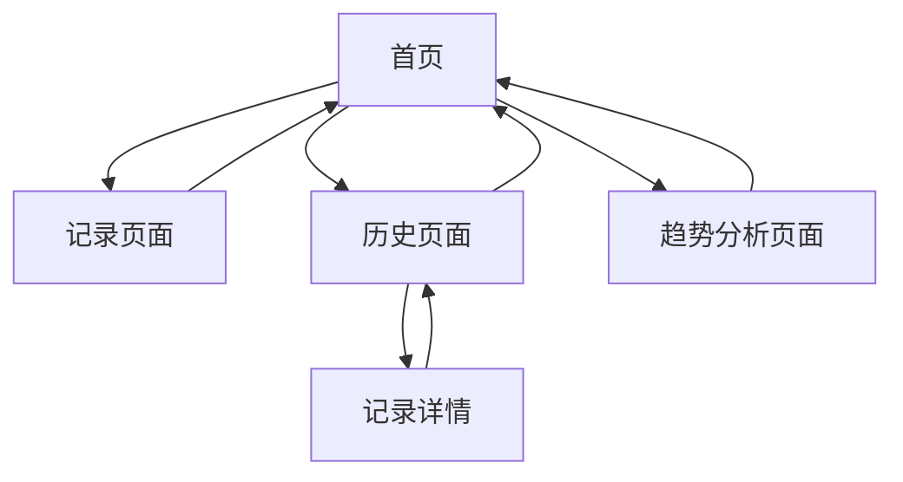

# 情绪记录疗愈应用产品需求文档

## 1. 产品概述
一个专注于情绪记录和疗愈体验的 Web 应用，帮助用户通过每日情绪记录、历史回顾和数据分析来更好地了解和管理自己的情绪状态。
- 通过简单直观的方式记录每日情绪，支持文字、图片和语音多种形式，为用户提供全方位的情绪表达渠道。
- 通过数据可视化和趋势分析，帮助用户发现情绪规律，促进心理健康和自我认知提升。

## 2. 核心功能

### 2.1 用户角色
本应用采用单一用户模式，无需复杂的角色区分：

| 角色 | 注册方式 | 核心权限 |
|------|----------|----------|
| 默认用户 | 直接访问应用 | 可记录情绪、查看历史、分析趋势等所有功能 |

### 2.2 功能模块
我们的情绪记录疗愈应用包含以下主要页面：
1. **首页**：情绪记录入口、今日状态展示、快速导航。
2. **记录页面**：情绪选择、日记编写、媒体上传。
3. **历史页面**：日历视图、列表浏览、记录详情。
4. **趋势分析页面**：情绪折线图、词云展示、情绪占比饼图。

### 2.3 页面详情

| 页面名称 | 模块名称 | 功能描述 |
|----------|----------|----------|
| 首页 | 欢迎区域 | 显示当前日期、天气心情、激励语句，营造温馨氛围 |
| 首页 | 今日状态 | 展示今日是否已记录情绪，显示当前情绪状态或提醒记录 |
| 首页 | 快速导航 | 提供记录情绪、查看历史、趋势分析的快捷入口 |
| 记录页面 | 情绪选择器 | 提供开心、难过、焦虑、平静、愤怒、兴奋等多种情绪选项，支持情绪强度调节 |
| 记录页面 | 日记编辑器 | 支持文字输入，提供情绪引导问题，字数统计，自动保存草稿 |
| 记录页面 | 媒体上传 | 支持照片上传和语音录制，提供预览和重新录制功能 |
| 记录页面 | 记录保存 | 验证必填项，保存记录到本地存储，显示保存成功提示 |
| 历史页面 | 日历视图 | 月历展示，标记有记录的日期，支持日期点击查看详情 |
| 历史页面 | 列表浏览 | 按时间倒序显示历史记录，支持分页加载，显示情绪和日记摘要 |
| 历史页面 | 记录详情 | 展示完整的情绪记录，包括情绪、日记、照片、语音等所有内容 |
| 趋势分析页面 | 情绪折线图 | 展示近30天情绪变化趋势，支持时间范围选择，情绪数值化展示 |
| 趋势分析页面 | 词云组件 | 从日记文本中提取高频词汇，根据出现频率调整字体大小和颜色 |
| 趋势分析页面 | 情绪占比饼图 | 统计各类情绪出现频次，以饼图形式展示情绪分布比例 |

## 3. 核心流程

**主要用户操作流程：**
用户进入应用后，首先看到温馨的首页界面，可以选择记录今日情绪或查看历史数据。在记录页面，用户依次选择当前情绪、编写日记内容、可选择上传照片或录音，最后保存记录。在历史页面，用户可以通过日历快速定位特定日期的记录，或通过列表浏览所有历史记录。在趋势分析页面，用户可以通过多种图表了解自己的情绪变化规律和特点。

## 4. 用户界面设计

### 4.1 设计风格
- **主色调**：奶白色 (#FEFEFE)、雾紫色 (#E6E0F8)、淡蓝色 (#E8F4FD)
- **辅助色**：柔和粉色 (#F8E8E8)、淡绿色 (#E8F8E8)、浅灰色 (#F5F5F5)
- **按钮风格**：圆角矩形，具有轻微阴影和渐变效果，营造果冻质感
- **字体**：优先使用系统默认字体，主标题 24px，正文 16px，辅助文字 14px
- **布局风格**：卡片式设计，大量留白，柔和的分割线和阴影
- **图标风格**：线性图标配合填充效果，圆润的边角，柔和的色彩过渡

### 4.2 页面设计概览

| 页面名称 | 模块名称 | UI元素 |
|----------|----------|--------|
| 首页 | 欢迎区域 | 渐变背景（奶白到淡蓝），大字号问候语，天气图标，柔和动画效果 |
| 首页 | 今日状态 | 圆形情绪图标，状态文字，进度环形图，微妙的呼吸动画 |
| 首页 | 快速导航 | 三个大按钮，圆角卡片样式，图标+文字，悬停时轻微放大 |
| 记录页面 | 情绪选择器 | 网格布局的情绪卡片，每个卡片包含表情图标和文字，选中时高亮 |
| 记录页面 | 日记编辑器 | 大文本框，占位符提示，字数统计，自动调整高度 |
| 记录页面 | 媒体上传 | 拖拽上传区域，预览缩略图，录音波形显示，操作按钮 |
| 历史页面 | 日历视图 | 月历网格，有记录的日期用彩色圆点标记，当前日期高亮 |
| 历史页面 | 列表浏览 | 时间线样式，每条记录为卡片形式，显示日期、情绪图标、日记摘要 |
| 趋势分析页面 | 情绪折线图 | 柔和的曲线，渐变填充，数据点标记，时间轴标签 |
| 趋势分析页面 | 词云组件 | 彩色词汇云，字体大小反映频率，随机但和谐的颜色搭配 |
| 趋势分析页面 | 情绪占比饼图 | 柔和色彩的扇形，百分比标签，图例说明 |

### 4.3 响应式设计
应用采用移动优先的响应式设计，优先适配手机端使用体验，同时兼容平板和桌面端。支持触摸交互优化，包括合适的点击区域大小、滑动手势支持等。